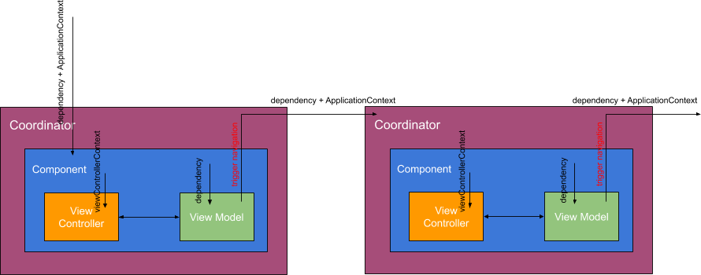

## SwiftVideos

**Collection of Swift/iOS-related conference videos**.

This project serves as a showcase for **the SuperArc project (TSP)**. 

**TSP** aims to standardize many common building blocks which can help developers to kickstart new iOS projects quickly.

The goal is to have a set of modules to create a component-based MVVM-C (Model-View-ViewModel-Coordinator) architecture for iOS apps. The modules are intended to use together but each module should be able to be integrated into any other iOS projects. For more information about the SuperArc project, please take a look at [here](https://github.com/superarcswift/SwiftVideos).

## Content

All content are curated from external sources such as Vimeo, Youtube or WWDC live streams. This is insipred heavily from [SwiftTube](http://www.swifttube.co/) and [talk & coffe app]()

## App Features

- Use json as database.
- Data is stored in raw json for easy integration with other tools.
- View list of iOS/Swift related conferences.
- View list of videos of conferences.
- View list of speakers of conferences.
- Use git for manage the json database (Content is hosted at [SwiftVideosContent](https://github.com/superarcswift/SwiftVideosContent)).

## Technologies

###Tech-Stack

- Swift 5.0
- Xcode 10+
- 3rd Party Dependencies:
	- **SuperArc**: PromiseKit, RxSwift, Action, RxCocoa, NotificationBanner.
	- **SwiftVideos**: RxDataSources, XCoordinator, objective-git, YoutubeKit, MarkdownView.

###Tests

- [ ] Unit Tests
- [ ] UI Tests
- [ ] Snapshot Tests

###Package manager

- [ ] Carthage
- [ ] Swift Package Manager
- [ ] Pods

### Tools

###Swiftlint:

[https://github.com/realm/SwiftLint](https://github.com/realm/SwiftLint)

###Danger:

[https://danger.systems](https://danger.systems)

###Documentation:

[https://github.com/realm/jazzy](https://github.com/realm/jazzy)
	
##Architecture

- [ ] µfeatures modules
- [ ] Clean architecture (at module level)

### ViewModel

- Responsible for performing business logics.

### ViewController

- Responseible for interaction with users, displaying result from `ViewModel`.

### Component

- Responseible for managing dependencies required by its `ViewController` & `ViewModel`.
- Instantiate `ViewController`, `ViewModel`.

### Coordinator (optional)

- Responsible for navigation.
- Instantiate `Component`.

## Building and Running

## Contribute

## License

MIT License. See [LICENSE](https://github.com/superarcswift/SwiftVideos/blob/master/LICENSE)
